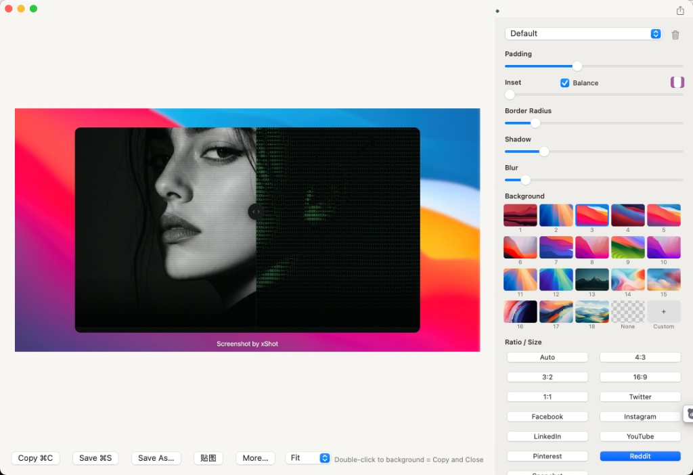

# xShot

macOS 菜单栏截图工具：框选或窗口截图后，一键套上背景、圆角、阴影，成品图自动写入系统剪贴板。



## 功能

- 美化截图：框选或窗口截图后套背景、圆角、阴影，打开编辑器，成品自动写入剪贴板
- 普通截图：框选后直接复制原图到剪贴板，不套背景、不打开编辑器
- 编辑器：Padding / Inset / 圆角 / 阴影 / 背景模糊、壁纸背景、比例预设、邮箱打码、水印
- 贴图：把剪贴板里的图片贴到桌面（非图片则无效果）
- 屏幕拾色：点击复制 `#RRGGBB`
- 样式会记住，下次美化截图沿用同一套模板
- 开机自启动（设置页开关）

## 快捷键

| 功能 | 默认 |
| --- | --- |
| 普通截图 | ⌥⌘1 |
| 美化截图 | ⌥⌘2 |
| 屏幕拾色 | ⌥⌘3 |
| 贴图 | ⌥⌘4 |

可在菜单栏图标 → 设置 中修改。

## 环境

- macOS 13 或更高
- 首次截图需授予「屏幕录制」权限：系统设置 → 隐私与安全性 → 屏幕录制 → xShot

## 构建

需要 [Xcode Command Line Tools](https://developer.apple.com/download/all/?q=command%20line%20tools)。

```bash
make
```

产物：`dist/xShot.app`

```bash
make run          # 运行
make dmg          # 打包 DMG
make version V=1.0.1
```

GitHub Actions 仅在手动触发或推送 `v*.*.*` 标签时发版，不会在普通 push 时自动升版本。

## 下载

在 [Releases](https://github.com/itgoyo/xShot/releases) 下载最新 `.dmg`，打开后将 `xShot.app` 拖入 Applications。

## 许可

本项目采用 [Apache License 2.0](LICENSE)。

Copyright 2026 itgoyo
